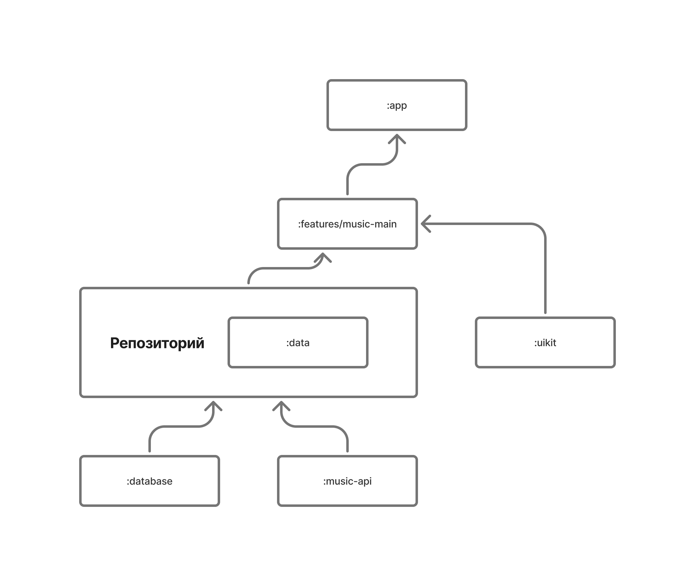
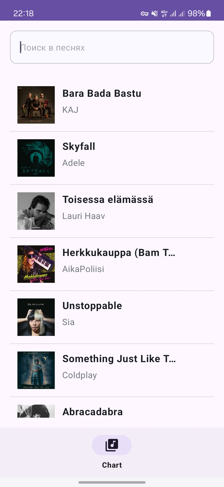
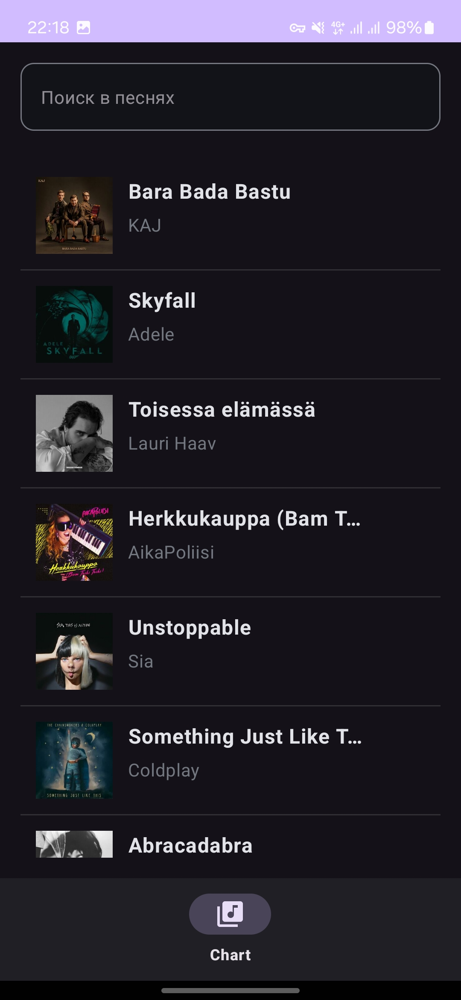
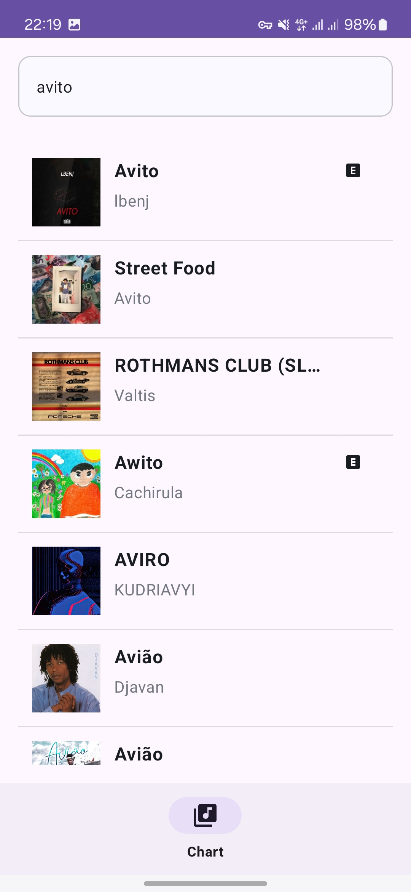
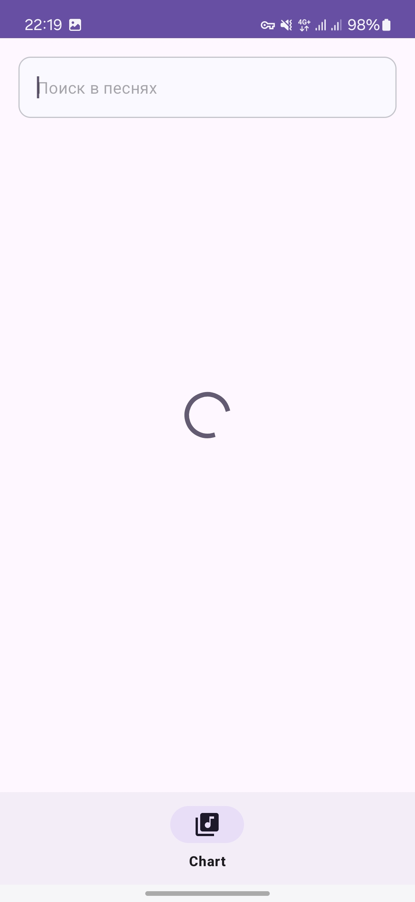
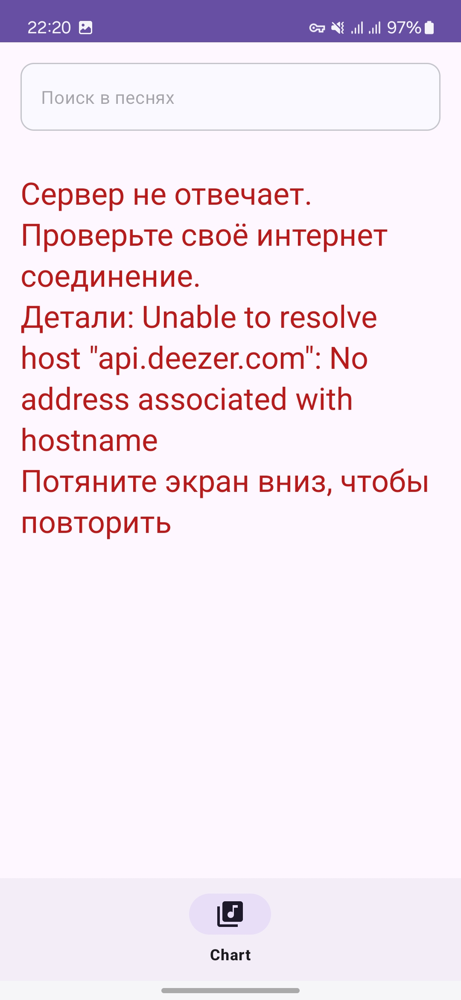
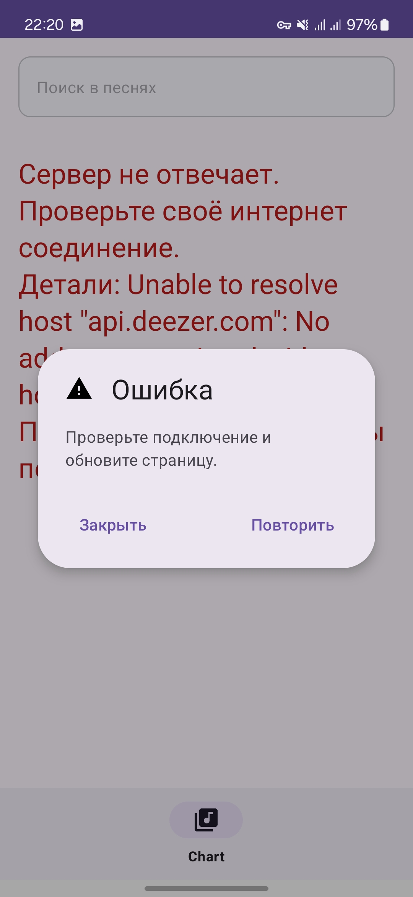

# Тестовое задание для стажёра Android-направления. Приложение Sonic-Flow.

## Описание

Был реализован один экран: экран со списком треков из чартов, с функцией поиска по трекам.  
Экран соответствует фукнкциональным и нефункциональным требованиям.  
Загрузка данных происходит из внешнего API Deezer.com.
При разработке архитектуры было решено следовать правилам Clean Architecture.  
Используемый архитектурный паттерн: MVVM.  
Приложение поддерживает светлую и тёмную темы.  

## Архитектура приложения выглядит следующим образом:

## APK для проверки

Скачать .apk файл для запуска на устройстве можно [ссылке](https://disk.yandex.ru/d/aGDdISktofwX-Q)

## Стек технологий

- Язык: kotlin
- Работа с сетью: Retrofit, OkHttp
- Многопоточность: Kotlin Coroutines/Flow
- View: XML
- Сериализаторы: Kotlinx Serialization
- Навигация: Fragment
- Архитектура: MVVM
- Загрузка изображений: Glide

## Скриншоты работы приложения

### Список треков из чарта

  
  

### Поиск по трекам

### Состояние загрузки

### Сообщение об ошибке

  
  

## Примечания:

Я столкнулся с несколькими трудностями при реализации медиа плеера, включая управление состоянием плеера, обработку метаданных треков и взаимодействие с медиа-сервисом.
Эти вопросы требовали дополнительных исследований и тестирования, что ограничило время на завершение всех задуманных функций.
В ветке [features/music-player](https://github.com/Ignat1902/Sonic-Flow/tree/features/music-player/features/music-player/src/main/java/dev/ginger/music/player) можно посмотреть мои наработки.

